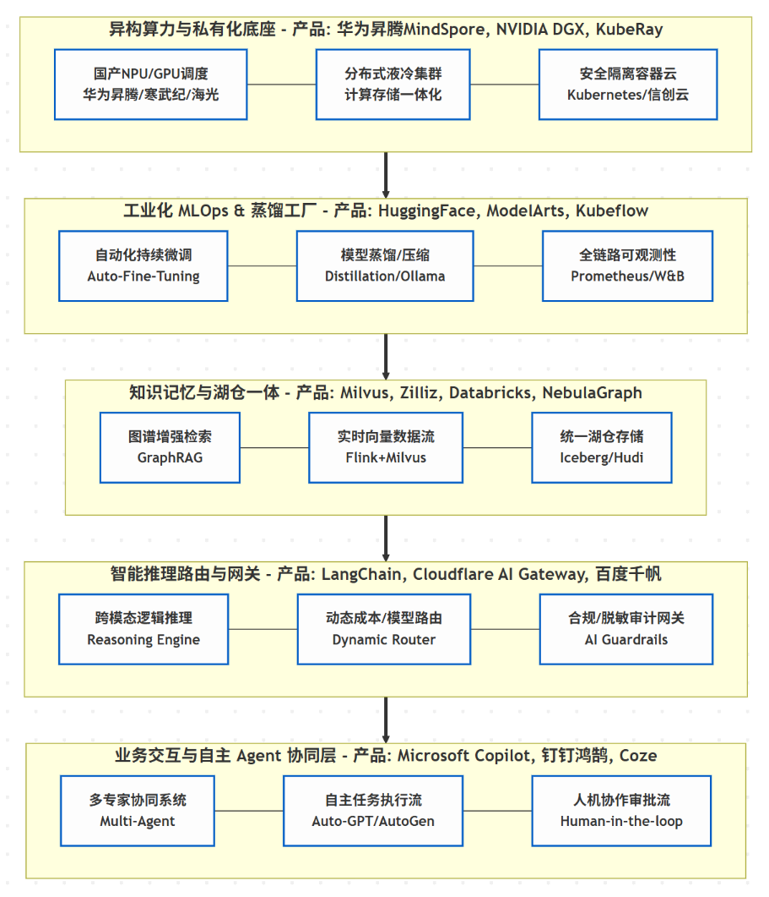

# 企业级 AI 大数据平台架构：从"能力集成"到"合规自主智能"的范式转移

**1\. 架构演进综述：从 RAG 到 Agentic Intelligence**

在 2026 年的视角下，企业 AI 架构已彻底告别了 2024 年简单的"对话框式"集成，转向以 **"自主多智能体 (Multi-Agent)"** 为核心的闭环系统。

- **知识深度的跃迁**：架构核心从向量检索进化为 **GraphRAG（图增强检索）**。通过将企业内部错综复杂的实体关系（如金融关联交易、医疗临床路径）转化为图谱，结合长效记忆层，彻底解决了模型在处理深度业务逻辑时的"幻觉"与"健忘"。
- **管理范式的改变**：架构中 **AI Gateway 2.0（智能路由）** 的成熟，标志着企业从"模型依赖"转向"模型治理"，实现了成本与性能的动态动态平衡。

**2\. 三大核心维度评析**

**A. 嵌入式合规体系：动态适配全球监管**

架构设计已从"事后审计"转向 **"合规即代码 (Compliance as Code)"**。

- **中国数据出入境合规**：根据国家网信办最新要求，架构在边缘侧部署了**敏感数据脱敏网关**。所有重要数据在跨境传输前，必须经过网关的实时分类分级与合规自测评。
- **全球标准适配**：针对 **GDPR** 的"遗忘权"、**HIPAA** 的 PHI 隔离以及 **FSI（金融）** 的算法可解释性，架构通过 **安全沙箱 (Guardrails)** 确保每一笔推理请求都具备完整的审计追踪 (Audit Trail)，实现"境内外双活、逻辑隔离"。

**B. 多智能体协作 (Multi-Agent/Expert System)**

2026 年的架构舍弃了"全能单体模型"，转向由**专门化 Agent** 组成的"数字专家组"。

- **协作引擎**：利用 Microsoft AutoGen 或 Salesforce Agentforce，系统能自动拆解复杂任务。例如，由"合规 Agent"审查风险、"分析 Agent"处理报表、"创意 Agent"润色话术。
- **自主决策**：智能体不再被动等待指令，而是能根据 KPI 自主调用 ERP、CRM 工具，并引入 **"人机协同 (Human-in-the-loop)"** 机制，确保重大决策有据可依、有人负责。

**C. 智能网关路由：实时动态决策**

网关层演变为平台的"神经中枢"，负责对每一次请求进行**毫秒级路由决策**：

- **模型路由 (Adaptive Routing)**：网关根据当前 Token 价格、模型延迟及任务复杂度（如 AWS Bedrock 的实践），自动判断是发给昂贵的 GPT-5（逻辑推理），还是发给低成本且私有化的本地 SLM 小模型（总结归纳）。
- **性能优化**：通过 **语义缓存 (Semantic Caching)** 减少 60% 的重复计算，显著降低了企业的 AI 运营支出 (OpEx)。

**3\. 未来展望：2026 年后的核心挑战**

- **AI 经济学深化**：如何精细化核算每个业务部门的 Agent 投入产出比 (ROI)。
- **主权 AI (Sovereign AI)**：在国产算力（如华为昇腾）与全球标准（如 NVIDIA）之间，构建具备韧性的**异构算力资源池**。
- **伦理与治理**：当智能体具备自主资金操作权限时，如何构建不可篡改的**数字责任链路**。

**结语**：

2024年，我们已经初步实现模型统一接入管理、调度与负载均衡、向量库、AI 代理（智能体）和跨境数据合规（自动脱敏审计），完成基本框架，实现AI服务可用。

2026 年的企业级 AI 平台不再是单一产品，而是**一套具备法律边界、行业深度与经济理性的数字生态系统**。它成功地将底层异构算力、中层图谱记忆与顶层自主 Agent 串联在一起。