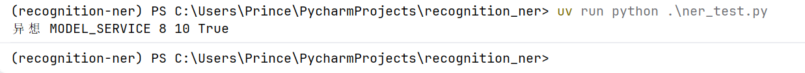

#  企业业务信息使用外部大模型服务的脱敏方案-简历脱敏NER模型训练方法
## 场景和问题：
简历业务文档希望借助大模型（如ChatGpt/Gemini/DeepSeek等）能力处理，提高工作效率，但大模型服务可能部署在企业外部甚至国外，而业务文档中可能含有各种敏感信息，
如个人隐私（姓名电话身份证号住址等），根据合规要求，HR需要将这些文档并交给大模型前实现脱敏和审计。

## 关键：
定制本地模型用于脱敏简历，支持中文和英文。那么需要定制化训练本地模型提升效果（尤其中文效果），这里演示怎么使用SpaCy使用500份简历数据训练识别自定义敏感词（即敏感实体NER）。
<br>训练核心要点：遵循统计推理原理和方法论，保证方向不出错。

## 方法和步骤：
SpaCy是一个基于 Python 的开源自然语言处理 (NLP) 库，专为生产环境设计，被称为“工业级”NLP 工具。
这里，我们主要训练它学习识别简历文档中的敏感实体，提升特定类型自定义敏感实体的识别，尤其是中文环境下。所以选择zh_core_web_trf（需要GPU）。 


## 总体流程的一个简单DEMO
spaCy v3 中，训练自定义命名实体识别（NER）模型不再推荐使用 Python 脚本循环训练，而是通过配置文件 (config.cfg) 结合命令行工具进行。 
0. 前提准备：
开发所需要的环境，含预训练模型（自行下载安装）、虚拟环境（python+CUDA）、训练数据集等，这里跳过此步

1. 数据标注与准备
<br>首先，你需要将文本标注为 spaCy 识别的格式。
<br>标注内容：
需要提供文本、实体在文中的起始位置（Start）、结束位置（End）以及标签名称（Label）。
<br>推荐工具：
<br>Prodigy：spaCy 官方开发的付费工具，与库集成度最高，支持主动学习。
<br>Label Studio：开源且功能强大，适合团队协作。
<br>格式转换：标注后的数据需转换为 .spacy 二进制格式。
```python
import spacy
from spacy.tokens import DocBin

nlp = spacy.blank("zh")
doc_bin = DocBin()
# 你的训练集数据，处理好放在这里
data = [("这件合同包含异想模型服务", {"entities": [(6, 8, "MODEL_SERVICE")]})]
for text, annot in data:
    doc = nlp.make_doc(text)
    example = spacy.training.Example.from_dict(doc, annot)
    doc_bin.add(example.reference)
doc_bin.to_disk("./train.spacy")
```
同样的方法，创建验证集，.dev.spacy
 ```python
import spacy
from spacy.tokens import DocBin

nlp = spacy.blank("zh")
doc_bin = DocBin()
# 你的验证集数据，处理好放在这里
data = [("新合同包含异想模型服务", {"entities": [(5, 7, "MODEL_SERVICE")]})]
for text, annot in data:
    doc = nlp.make_doc(text)
    example = spacy.training.Example.from_dict(doc, annot)
    doc_bin.add(example.reference)
doc_bin.to_disk("./dev.spacy")
```

2. 生成训练配置
<br>使用 spaCy Quickstart（https://spacy.io/usage/training） 工具生成基础配置文件。 

<br>如果是微调 zh_core_web_lg：在 Quickstart 中选择 Chinese，硬件选 CPU，Pipeline 选 ner。
<br>如果是微调 zh_core_web_trf：在 Quickstart 中选择 Chinese，硬件选 GPU (Transformer)，Pipeline 选 ner。 

<br>使用命令行初始化配置：
```bash
python -m spacy init fill-config base_config.cfg config.cfg
```

3. 以预训练模型为基础进行微调
<br>要基于 zh_core_web_lg 或 trf 进行微调，关键在于在 config.cfg 中设置初始化来源（Sourcing）。 

<br>修改 config.cfg：
<br>在 [initialize] 部分，指定要加载的预训练模型路径或名称：
```ini
[initialize]
vectors = "zh_core_web_lg"
```

保留原实体（可选）：
<br>如果你想保留模型原有的实体识别能力（如 PERSON, ORG），直接在已有模型上添加新标签进行训练；如果只想识别特定新类型，通常建议在空白模型上训练或冻结其他组件
<br>（通过配置文件[training]设置frozen_components = ["transformer"]和annotating_components = ["ner"]）。 

4. 执行训练
准备好 train.spacy、dev.spacy（验证集）和 config.cfg 后，放在同一个目录下，运行以下命令： 

```bash
python -m spacy train config.cfg --output ./output --paths.train ./train.spacy --paths.dev ./dev.spacy
```
如果是 Transformer 模型：确保已安装 spacy-transformers 并在有 GPU 的环境下运行，spaCy 会自动处理 Transformer 层的微调。 

5. 测试
比如使用下面代码测试
```python
import spacy
# 此时不需要加载 zh_core_web_trf，直接加载你练好的目录,best或者last模型
nlp = spacy.load("./output/model-last")

doc = nlp("新的一版合同包含异想模型服务")
for ent in doc.ents:
    print(ent.text, ent.label_,ent.start, ent.end,ent.has_vectot)
```
正常应该输出以下结果：



<br>建议：
<br>zh_core_web_lg：适合追求推理速度、标注样本量较小（几百条）的场景。
<br>zh_core_web_trf：适合追求极致准确率、有 GPU 算力支持且样本量相对充足的场景。


## 文档分割

面对 100 篇甚至更多文档时，不能一次性把所有文本塞进一个超长字符串，这会破坏模型的句子边界识别且容易导致内存溢出。简历可以按行分割。
<br>以下是处理大规模数据的标准工作流：
1. 文档处理：不要合并，要分块
<br>不要将 100 篇文档解析成一个超长输入。
<br>做法：保持文档的独立性。如果单篇文档非常长（超过 512 个 Token，尤其是使用 trf 模型时），建议按句子或段落切分。
<br>存储：将所有文档转化为一个 DocBin 对象，spaCy 会自动处理序列化。
2. 新实体的定义与配置
<br>你不需要在某个特定的“定义表”里注册新标签。
<br>标签定义：在数据准备阶段，只要你的训练数据 train.spacy 中出现了新的标签（如 "MEDICAL_DEVICE"），spaCy 在初始化训练时会自动检测到并将其加入 NER 层的分类头中。
<br>已有标签（灾难性遗忘）：如果你微调 zh_core_web_lg，且只标注了新实体，模型可能会“忘记”原有的 PERSON 或 ORG。
<br>解决方案：在 100 篇文档中，也需要对原有的重要实体进行标注（混合标注），或者使用 spacy-llm 等工具预标注原有实体。
3. 批量转换脚本 (Python)
<br>假设你的 100 篇文档存在一个文件夹里，每篇文档对应一个 JSON 标注文件：
```python
import spacy
from spacy.tokens import DocBin
import json
import os

nlp = spacy.blank("zh") # 或者 spacy.load("zh_core_web_lg")
doc_bin = DocBin()

# 假设你的标注数据在 data 列表里
# data = [{"text": "内容...", "entities": [(start, end, "MY_LABEL"), ...]}, ...]

for item in data:
    text = item["text"]
    entities = item["entities"]
    doc = nlp.make_doc(text)
    ents = []
    for start, end, label in entities:
        span = doc.char_span(start, end, label=label, alignment_mode="contract")
        if span is None:
            print(f"跳过无效标注: {text[start:end]}")
        else:
            ents.append(span)
    doc.ents = ents
    doc_bin.add(doc)

doc_bin.to_disk("./train.spacy")
```

4. 关键配置 (config.cfg)
<br>在 config.cfg 中，你需要关注：
<br>[components.ner]：这是 NER 组件。如果你是基于 zh_core_web_lg 微调，训练命令会读取 train.spacy 里的所有唯一标签，并更新模型。
<br>GPU 设置：如果是 100 篇文档且使用 trf (Transformer)，必须在 config.cfg 中配置 [training.optimizer] 使用 GPU，否则速度极慢。

## 避免新模型遗忘老的实体

为了避免“灾难性遗忘”（即训练了新标签，模型却忘了怎么识别 PERSON 或 GPE），最推荐的方法是：先用原有的 zh_core_web_lg 跑一遍你的 100 篇文档，把它的预测结果存下来，再叠加你的手动标注。
以下是实现“混合标注”的具体操作步骤：
1. 自动预标注原有实体 (Silver Labels)
你可以写一个简单的脚本，让现有模型帮你完成基础工作：
```python
import spacy
from spacy.tokens import DocBin

# 加载官方大模型
nlp_base = spacy.load("zh_core_web_lg")
doc_bin = DocBin()

# 假设你的 100 篇原始文档存放在 docs_list 中
for text in docs_list:
    doc = nlp_base(text) # 先让模型预测原有的实体 (如 PERSON, ORG)
    
    # 获取模型预测的实体列表
    existing_ents = list(doc.ents)
    
    # 【关键点】在此处添加你的自定义标注
    # 假设你在该文档中发现了新实体 (start, end, "MY_NEW_LABEL")
    # span = doc.char_span(start, end, label="MY_NEW_LABEL")
    # if span: existing_ents.append(span)
    
    # 解决冲突：如果有重叠，需过滤（spaCy 不允许实体重叠）
    doc.ents = spacy.util.filter_spans(existing_ents)
    
    doc_bin.add(doc)

doc_bin.to_disk("./train.spacy")
```
2. 使用 spacy-llm（进阶方案）
<br>如果你觉得官方模型的准确率不够，想利用 GPT-4 或 Claude 来帮你标注 100 篇文档作为训练集：
<br>安装：pip install spacy-llm
<br>配置 config.cfg：定义 Prompt 模板，告诉 LLM 你需要识别哪些标签（包括官方的和自定义的）。
<br>运行：
```python
from spacy_llm.util import assemble
nlp = assemble("llm_config.cfg") # 配置文件里写好你的 OpenAI API Key 和 Prompt
doc = nlp("公司 A 正在研发新型 AI 芯片。")
# 它会直接返回带实体的 Doc 对象，之后同样存入 DocBin
```

3. 训练时的注意事项
<br>当你有了混合标注的 train.spacy 后，在 config.cfg 中微调时：
<br>保持一致性：确保验证集 (dev.spacy) 也包含相同类型的混合标注，否则评估分数会很难看。
<br>冻结部分参数：如果是微调 trf (Transformer)，可以在配置文件中设置 frozen_components = ["transformer"]，只训练最后的 NER 表头，这样能更好地保留原始语言感知能力。


## 上下文增强（Context-aware Labeling）
针对“通过上下文（如‘芳龄’）来确定实体（如‘18’为年龄）”的需求，这属于 上下文增强（Context-aware Labeling）。
<br>在训练 spaCy 模型时，处理这类逻辑主要有两种路径：标注阶段处理（生成高质量训练数据）或 模型架构微调。
1. 在标注阶段处理（最推荐：基于规则的预标注）
不要手动去翻 100 篇文档。你可以利用 spaCy 的 EntityRuler 或 Matcher 编写简单的逻辑，利用“芳龄”这个关键词自动锁定后面的数字，并将其标注为 AGE。
<br>代码实现示例：
```python
import spacy
from spacy.matcher import Matcher

nlp = spacy.load("zh_core_web_lg")
matcher = Matcher(nlp.vocab)

# 定义模式：匹配“芳龄”后面跟着 1-3 位数字
pattern = [{"TEXT": "芳龄"}, {"IS_DIGIT": True, "LENGTH": {"<=": 3}}]
matcher.add("AGE_DETECTOR", [pattern])

# 扩展 Matcher 模式(可选)
patterns = [
    [{"TEXT": "芳龄"}, {"IS_DIGIT": True}],          # 芳龄18 -> 标18
    [{"IS_DIGIT": True}, {"TEXT": "岁"}],          # 18岁   -> 标18
    [{"TEXT": "芳龄"}, {"IS_DIGIT": True}, {"TEXT": "岁"}] # 芳龄18岁 -> 标18
]
matcher.add("AGE_RULE", patterns)
# 扩展 Matcher 模式(可选)

# 更加鲁棒的中文匹配规则。还可以进一步限制数字范围，甚至加入分隔符（用于简历头部）
# 定义通用的数字正则：匹配 18, 123 或 十八, 一百, 廿
# [0-9]+ 匹配阿拉伯数字
# [一二三四五六七八九十百千万]+ 匹配中文数字
num_regex = "^([0-9]+|[一二三四五六七八九十百千万]+)$"

# 合并模式定义
patterns = [
    # 1. 芳龄 + 数字 (如：芳龄18, 芳龄十八)
    [{"TEXT": "芳龄"}, {"TEXT": {"REGEX": num_regex}}],
    
    # 2. 数字 + 岁 (如：18岁, 十八岁)
    [{"TEXT": {"REGEX": num_regex}}, {"TEXT": "岁"}],
    
    # 3. 兼容分词器把“数字+岁”切成一个词的情况 (如：["18岁"] 或 ["十八岁"])
    [{"TEXT": {"REGEX": f"{num_regex}岁"}}]
]
# 更加鲁棒的中文匹配规则

text = "她芳龄18，青春无敌。"
doc = nlp(text)
matches = matcher(doc)

# 将匹配到的“18”提取为实体
new_ents = list(doc.ents)
for match_id, start, end in matches:
    # span 是 [芳龄, 18]，我们只需要 [18]，即下标为 end-1
    age_span = doc[end-1 : end] 
    new_ents.append(spacy.tokens.Span(doc, age_span.start, age_span.end, label="AGE"))

doc.ents = spacy.util.filter_spans(new_ents) # 自动去重
```
2. 在模型训练中处理（特征工程）
如果你希望模型自己学会这种上下文联系，而不是靠硬编码规则，你需要：
<br>提供足够的上下文样本：在你的 100 篇文档中，确保所有出现“芳龄/年龄/岁”后的数字都被正确标注。
<br>使用 Transformer 模型 (zh_core_web_trf)：
<br>原理：Transformer 的注意力机制（Attention）天生就是为了处理这种联系。它能注意到“18”前面的“芳龄”，从而把“18”从普通数字分类为 AGE。
<br>操作：在 config.cfg 中，确保 [components.ner.model.tok2vec] 使用的是 spacy-transformers 提供的模型，它能捕捉长距离的语义关联。
3. 在推理阶段处理（后处理逻辑）
如果模型训练后偶尔还是会漏掉，你可以通过 EntityRuler 将规则注入到模型流水线中：
```python
# 在训练好的模型后加一层规则校验
nlp_trained = spacy.load("./output/model-best")
ruler = nlp_trained.add_pipe("entity_ruler", before="ner")
patterns = [{"label": "AGE", "pattern": [{"TEXT": "芳龄"}, {"IS_DIGIT": True}]}]
ruler.add_patterns(patterns)
```

## 训练

在 本地 GPU 环境下微调 zh_core_web_trf，以下是针对中文 Transformer 模型的 config.cfg 核心配置参数。
<br>这些设置能确保模型正确调用 GPU，并防止在微调 100 篇文档时发生显存溢出或学习率过快导致模型崩溃。
1. 生成基础配置文件
首先，使用命令生成一个支持 GPU 的基础配置（这会默认关联 bert-base-chinese 或类似的 Transformer 层）：
```bash
python -m spacy init fill-config base_config.cfg config.cfg --pipeline ner --optimize accuracy --gpu
```
2. 关键参数手动微调 (config.cfg)
<br>打开生成的 config.cfg，重点检查并修改以下部分：
<br>A. 学习率与优化器 (Training)
<br>Transformer 模型需要极小的学习率。
```ini
[training.optimizer]
@optimizers = "Adam.v1"

[training.optimizer.learn_rate]
@schedules = "warmup_linear.v1"
warmup_steps = 250
total_steps = 20000
initial_rate = 5e-5  # 关键：Transformer 微调建议 1e-5 到 5e-5 之间
```

B. 批次大小 (Batch Size)
<br>对于 100 篇文档，由于 Transformer 显存占用大，建议使用较小的 batch_size：
```ini
[training.batcher]
@batchers = "spacy.batch_by_words.v1"
discard_oversize = true
size = 2000  # 根据你的 GPU 显存调整，8G 显存建议 2000-3000
```

C. 累积梯度 (Accumulating Gradients)
<br>如果显存实在不够（如 4G/6G），可以开启梯度累积，模拟大 Batch：
```ini
[training]
accumulate_gradient = 3  # 每 3 个 step 更新一次权重
```

D. 冻结 Transformer 层（可选但推荐）
<br>如果你的 100 篇文档量级较小，为了保护预训练模型的通用性，可以先冻结 Transformer 底层，只训练 NER 表头：
```ini
[training]
frozen_components = ["transformer"]
```

3. 开始训练命令
确保你的环境中安装了 spacy-transformers 和对应的 PyTorch：
```bash
# 指定 GPU ID（通常是 0）
export CUDA_VISIBLE_DEVICES=0 
python -m spacy train config.cfg --output ./output --paths.train ./train.spacy --paths.dev ./dev.spacy --gpu-id 0
```

4. 验证效果
<br>训练完成后，你可以用以下脚本测试“芳龄”与“数字范围”的结合效果：
```python
import spacy
nlp = spacy.load("./output/model-best")
doc = nlp("这位老人家芳龄一百零二岁，依然精神矍铄。")
for ent in doc.ents:
    print(f"实体: {ent.text}, 标签: {ent.label_}")
```

## 模型评估优化

训练模型的优化是一个循环迭代的过程。在 spaCy v3 中，评估和优化主要围绕 性能指标分析 和 数据质量修正 展开。
1. 核心评估指标 (Evaluation)
<br>运行 spacy train 后，你会得到一个 meta.json 或在终端看到以下指标：
<br>ENTS_P (Precision, 精确率)：模型预测出的“AGE”里，有多少是真的？（解决误报/多标）
<br>ENTS_R (Recall, 召回率)：文档中所有的“AGE”，模型抓住了多少？（解决漏报/少标）
<br>ENTS_F (F-Score)：P 和 R 的调和平均值。生产级目标通常 > 0.85。
2. 如何诊断并优化？
<br>A. 解决“漏报” (提高 Recall)
<br>现象：模型对某些格式（如“一十五岁”）识别不出来。
<br>优化：
<br>增加多样性数据增强：检查你的增强脚本，是否覆盖了所有可能的中文数字组合。
<br>降低 L2 正则化：在 config.cfg 中微调 [training.optimizer]，让模型更敏感。
<br>检查分词：如果“18岁”被切成了“1”“8”“岁”，模型可能困惑。考虑使用 char_base 的 Transformer。
<br>B. 解决“误报” (提高 Precision)
<br>现象：模型把“100元”或“18号”也标成了 AGE。
<br>优化：
<br>增加负样本：把这些被标错的句子存入 train.spacy，但 ents 设为空。这是最有效的“降噪”手段。
<br>强化上下文权重：确保训练数据中，AGE 标签附近一定有“岁”、“芳龄”等强特征。
<br>C. 解决“灾难性遗忘”
<br>现象：模型学会了 AGE，但原来的 PERSON（人名）识别不准了。
<br>优化：在 config.cfg 中设置 [training] frozen_components = ["transformer"]，只训练 NER 头部，不破坏底层的语言表示。
3. 交叉验证 (Cross-Validation)
<br>如果你只有 100 篇文档，建议使用 K-Fold 交叉验证：
<br>将 100 篇分为 5 组（每组 20 篇）。
<br>轮流用 4 组训练，1 组评估。
<br>观察不同组之间的 F-Score 波动。如果波动巨大，说明你的 数据分布不均（有的文档太特殊），需要补充更多样化的样本。
4. 离线评估脚本
<br>手动写一个脚本，对比“模型预测”与“原始标注”：
```python
from spacy.scorer import Scorer
from spacy.training import Example

def evaluate(model_path, dev_data):
    nlp = spacy.load(model_path)
    scorer = Scorer()
    examples = []
    for text, annotations in dev_data:
        doc = nlp.make_doc(text)
        example = Example.from_dict(doc, annotations)
        example.predicted = nlp(text) # 获取预测结果
        examples.append(example)
    
    scores = scorer.score(examples)
    print(f"NER P: {scores['ents_p']:.2f}, R: {scores['ents_r']:.2f}, F: {scores['ents_f']:.2f}")

# 使用 model-best 进行最终验证
```

5. 推理速度优化
<br>如果 trf 模型在生产环境下太慢：
<br>使用 GPU 推理：spacy.require_gpu()。
<br>ONNX 导出：将模型导出为 ONNX 格式，使用 onnxruntime 加速。
<br>模型蒸馏：如果 trf 太重，尝试将它的知识“教”给 zh_core_web_lg（CPU 友好）。


## 借助BERT/RoBERTa

通过 spacy-transformers 库将其作为模型的 嵌入层（Embedding Layer） 或 编码器（Encoder）使用RoBERTa。
<br>这是目前处理简历表格、乱码、以及“孤立数字”最强的方案，因为 BERT 的 Attention 机制 能捕获跨越符号（如 |、/）的深层联系。
1. 核心架构：Transformer 管道
<br>在 spaCy 中，BERT 会作为一个 transformer 组件放在流水线的最前面，后面接你的 ner 组件。
<br>BERT 的作用：将“18”这个数字转化为一个高维向量。如果左边有“年龄”，或者右边有“男”，这个向量的数值会发生偏移，从而告诉 NER 组件：这是一个 AGE。
2. 环境配置 (Linux GPU)
<br>首先安装支持库：
```bash
pip install spacy[cuda11x,transformers] 
# 建议安装中文专用 BERT
pip install torch transformers
```

3. 如何配置使用中文 BERT / RoBERTa
<br>你不需要自己写 PyTorch 代码，只需要在 config.cfg 中指定 HuggingFace 上的模型名称。
<br>推荐模型：
<br>BERT: bert-base-chinese (万能基础款)
<br>RoBERTa: hfl/chinese-roberta-wwm-ext (中文全词掩码，效果通常比基础 BERT 好)
<br>MacBERT: hfl/chinese-macbert-base (纠错能力强，适合处理 PDF 识别乱码)
<br>修改 config.cfg：
```ini
[components.transformer]
factory = "transformer"
max_batch_items = 4096

[components.transformer.model]
@architectures = "spacy-transformers.TransformerModel.v3"
# 在这里替换你想要的模型
name = "hfl/chinese-roberta-wwm-ext" 

[components.transformer.model.get_spans]
@span_getters = "spacy-transformers.strided_spans.v1"
window_size = 128
stride = 96
```

4. 解决简历“隔离符号”的特技：自定义 Tokenizer
<br>由于 BERT 是按字或词根切分的，简历中的 | 或 / 可能会被切碎。为了让 RoBERTa 更好地理解表格结构，你可以设置 spaCy 不要过滤分割符。

5. 为什么 RoBERTa 辅助效果更好？
<br>上下文补全：RoBERTa 经过海量中文预训练，它知道“年龄”后面高概率出现数字。
<br>抗噪性：PDF 提取出的 1 8（带空格）在 Transformer 看来，通过位置编码仍然能通过 1 和 8 的组合识别出数值，比纯正则匹配鲁棒性高得多。
<br>多标签区分：RoBERTa 能区分 2023（出现在文首通常是年份）和 22（出现在姓名旁通常是年龄）。
6. 训练命令
<br>准备好 config.cfg（确保 [components.ner.model.tok2vec] 指向了 transformer），直接在 Linux 运行：
```bash
# 自动从 HuggingFace 下载 RoBERTa 模型并开始微调
python -m spacy train config.cfg --output ./output --paths.train ./train.spacy --paths.dev ./dev.spacy --gpu-id 0
```

建议
<br>针对 500-1000 篇简历样本：
<br>模型选型：首选 hfl/chinese-roberta-wwm-ext。
<br>微调策略：初期建议冻结 Transformer 层只练 NER 头（速度快），后期全量微调（精度高）。
<br>显存注意：RoBERTa 比较重，12GB 显存建议 window_size 设为 128 或 256。
<br>争取冲刺90%以上水平