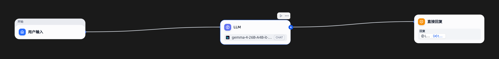

# Dify 中编排 聊天Agent DEMO

**简介**：

Dify 中编排 聊天Agent DEMO。是个最简单的雏形。后续可自行添加其他特性（比如是否需要联网、联网查询那些词、返回结果如何处理）

纯学习研究分享，请合法合理使用。

**文件/步骤说明**：

**1\. chat_agent.yml：纯本地LLM聊天的agent**

**2\. chat_test.yml:可以联网搜索，并把结果给本地LLM聊天的agent**

